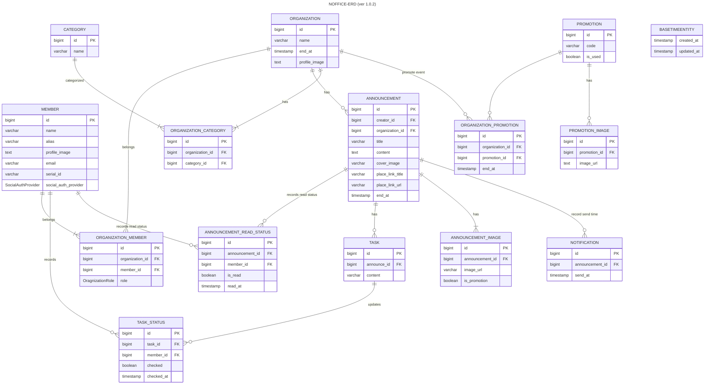

# Noffice-mermaid ERD

- [NOFFICE-ERD (ver 0.1.2)](https://www.mermaidchart.com/raw/8ac96ad3-73fd-476f-9e52-d32c2b602360?theme=light&version=v0.1&format=svg)

```mermaid
---
title : NOFFICE-ERD (ver 1.0.2)
---
erDiagram
    MEMBER ||--|{ ORGANIZATION_MEMBER: belongs
    MEMBER {
        bigint id PK
        varchar name
        varchar alias
        text profile_image
        varchar email
        varchar serial_id
        SocialAuthProvider social_auth_provider
    }

    ORGANIZATION ||--|{ ORGANIZATION_MEMBER: belongs
    ORGANIZATION ||--o{ ANNOUNCEMENT: "has"
    ORGANIZATION {
        bigint id PK
        varchar name
        timestamp end_at
        text profile_image
    }

    ANNOUNCEMENT {
        bigint id PK
        bigint creator_id FK
        bigint organization_id FK
        varchar title
        text content
        varchar cover_image
        varchar place_link_title
        varchar place_link_url
        timestamp end_at
    }

    MEMBER ||--o{ TASK_STATUS: records
    TASK ||--o{ TASK_STATUS: updates
    TASK_STATUS {
        bigint id PK
        bigint task_id FK
        bigint member_id FK
        boolean checked
        timestamp checked_at
    }

    ANNOUNCEMENT ||--o{ ANNOUNCEMENT_READ_STATUS: "records read status"
    MEMBER ||--o{ ANNOUNCEMENT_READ_STATUS: "records read status"
    ANNOUNCEMENT_READ_STATUS {
        bigint id PK
        bigint announcement_id FK
        bigint member_id FK
        boolean is_read
        timestamp read_at
    }

    ANNOUNCEMENT ||--o{ TASK: has
    TASK {
        bigint id PK
        bigint announce_id FK
        varchar content
    }

    ANNOUNCEMENT ||--|{ ANNOUNCEMENT_IMAGE: "has"
    ANNOUNCEMENT_IMAGE {
        bigint id PK
        bigint announcement_id FK
        varchar image_url
        boolean is_promotion
    }

    ORGANIZATION_MEMBER {
        bigint id PK
        bigint organization_id FK
        bigint member_id FK
        OragnizationRole role
    }
    ORGANIZATION ||--|{ ORGANIZATION_CATEGORY: has
    ORGANIZATION_CATEGORY {
        bigint id PK
        bigint organization_id FK
        bigint category_id FK
    }
    CATEGORY ||--|{ ORGANIZATION_CATEGORY: categorized
    CATEGORY {
        bigint id PK
        varchar name
    }
    ORGANIZATION ||--o{ ORGANIZATION_PROMOTION: "promote event"
    PROMOTION ||--o{ ORGANIZATION_PROMOTION: ""
    PROMOTION {
        bigint id PK
        varchar code
        boolean is_used
    }

    PROMOTION ||--o{ PROMOTION_IMAGE: "has"
    PROMOTION_IMAGE {
        bigint id PK
        bigint promotion_id FK
        text image_url
    }

    ORGANIZATION_PROMOTION {
        bigint id PK
        bigint organization_id FK
        bigint promotion_id FK
        timestamp end_at
    }

    ANNOUNCEMENT ||--o{ NOTIFICATION: "record send time"
    NOTIFICATION {
        bigint id PK
        bigint announcement_id FK
        timestamp send_at
    }

    BASETIMEENTITY {
        timestamp created_at
        timestamp updated_at
    }
```