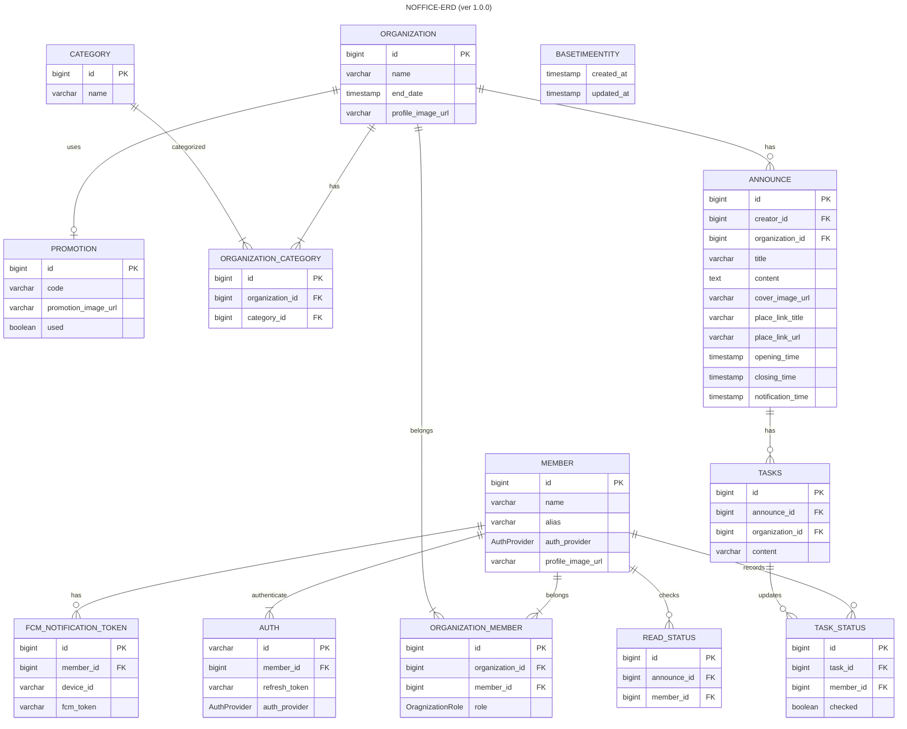

# Noffice-mermaid ERD

```mermaid
---
title : NOFFICE-ERD (ver 1.0.0)
---
erDiagram
    MEMBER {
        bigint id PK
        varchar name
        varchar alias
        AuthProvider auth_provider
        varchar profile_image_url
    }

    ORGANIZATION {
        bigint id PK
        varchar name
        timestamp end_date
        varchar profile_image_url
    }

    MEMBER ||--|{ ORGANIZATION_MEMBER : belongs
    ORGANIZATION ||--|{ ORGANIZATION_MEMBER : belongs
    ORGANIZATION_MEMBER {
        bigint id PK
        bigint organization_id FK
        bigint member_id FK
        OragnizationRole role
    }

    MEMBER ||--o{ FCM_NOTIFICATION_TOKEN : has
    FCM_NOTIFICATION_TOKEN {
        bigint id PK
        bigint member_id FK
        varchar device_id
        varchar fcm_token
    }

    MEMBER ||--|{ AUTH : authenticate
    AUTH {
        varchar id PK
        bigint member_id FK
        varchar refresh_token
        AuthProvider auth_provider
    }

    MEMBER ||--o{ READ_STATUS : checks
    READ_STATUS {
        bigint id PK
        bigint announce_id FK
        bigint member_id FK
    }

    ORGANIZATION ||--o| PROMOTION : "uses"
    PROMOTION {
        bigint id PK
        varchar code
        varchar promotion_image_url
        boolean used
    }

    ORGANIZATION ||--|{ ORGANIZATION_CATEGORY : has
    CATEGORY ||--|{ ORGANIZATION_CATEGORY : categorized
    ORGANIZATION_CATEGORY {
        bigint id PK
        bigint organization_id FK
        bigint category_id FK
    }

    CATEGORY {
        bigint id PK
        varchar name
    }

    ORGANIZATION ||--o{ ANNOUNCE : "has"
    ANNOUNCE {
        bigint id PK
        bigint creator_id FK
        bigint organization_id FK
        varchar title
        text content
        varchar cover_image_url
        varchar place_link_title
        varchar place_link_url
        timestamp opening_time
        timestamp closing_time
        timestamp notification_time
    }

    MEMBER ||--o{ TASK_STATUS : records
    TASKS ||--o{ TASK_STATUS : updates
    TASK_STATUS {
        bigint id PK
        bigint task_id FK
        bigint member_id FK
        boolean checked
    }

    ANNOUNCE ||--o{ TASKS : has
    TASKS {
        bigint id PK
        bigint announce_id FK
        bigint organization_id FK
        varchar content
    }

    BASETIMEENTITY {
        timestamp created_at
        timestamp updated_at
    }
```