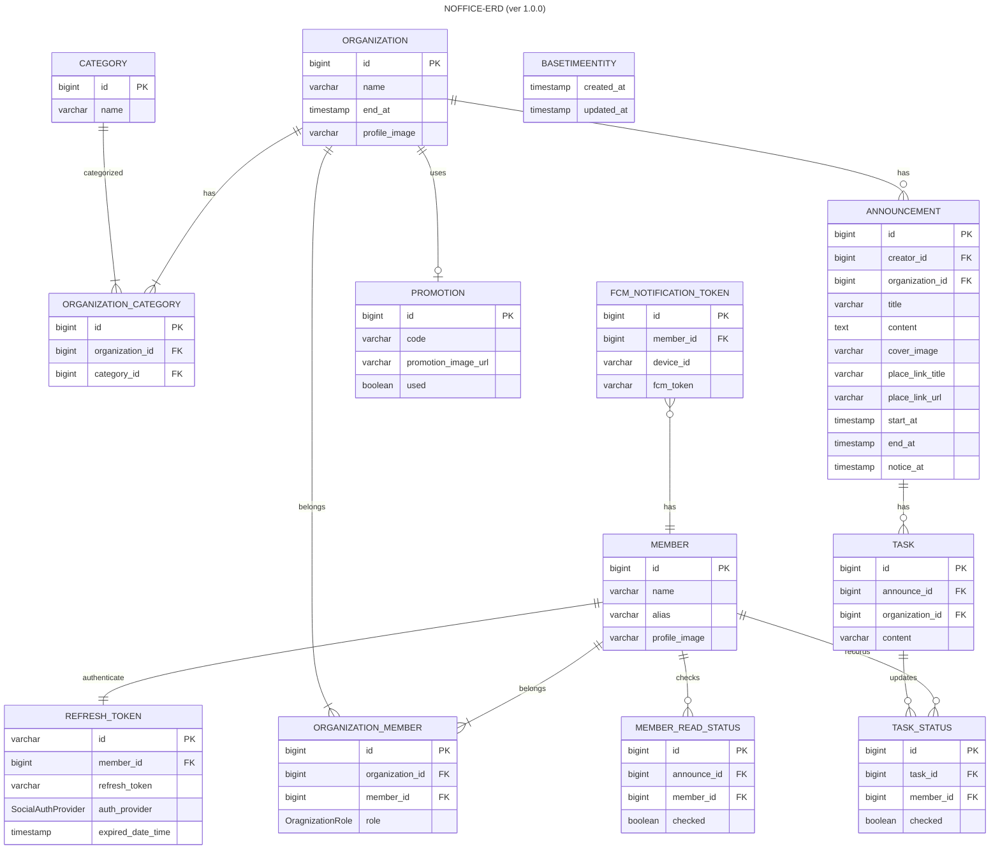

# Noffice-mermaid ERD

```mermaid
---
title : NOFFICE-ERD (ver 1.0.0)
---
erDiagram
    MEMBER {
        bigint id PK
        varchar name
        varchar alias
        varchar profile_image
    }

    ORGANIZATION {
        bigint id PK
        varchar name
        timestamp end_at
        varchar profile_image
    }
    ORGANIZATION ||--|{ ORGANIZATION_CATEGORY: has
    CATEGORY ||--|{ ORGANIZATION_CATEGORY: categorized
    ORGANIZATION_CATEGORY {
        bigint id PK
        bigint organization_id FK
        bigint category_id FK
    }

    CATEGORY {
        bigint id PK
        varchar name
    }

    MEMBER ||--|{ ORGANIZATION_MEMBER: belongs
    ORGANIZATION ||--|{ ORGANIZATION_MEMBER: belongs
    ORGANIZATION_MEMBER {
        bigint id PK
        bigint organization_id FK
        bigint member_id FK
        OragnizationRole role
    }

    FCM_NOTIFICATION_TOKEN }o--|| MEMBER: "has"
    FCM_NOTIFICATION_TOKEN {
        bigint id PK
        bigint member_id FK
        varchar device_id
        varchar fcm_token
    }

    MEMBER ||--|| REFRESH_TOKEN: authenticate
    REFRESH_TOKEN {
        varchar id PK
        bigint member_id FK
        varchar refresh_token
        SocialAuthProvider auth_provider
        timestamp expired_date_time
    }

    MEMBER ||--o{ MEMBER_READ_STATUS: checks
    MEMBER_READ_STATUS {
        bigint id PK
        bigint announce_id FK
        bigint member_id FK
        boolean checked
    }

    ORGANIZATION ||--o| PROMOTION: "uses"
    PROMOTION {
        bigint id PK
        varchar code
        varchar promotion_image_url
        boolean used
    }

    ORGANIZATION ||--o{ ANNOUNCEMENT: "has"
    ANNOUNCEMENT {
        bigint id PK
        bigint creator_id FK
        bigint organization_id FK
        varchar title
        text content
        varchar cover_image
        varchar place_link_title
        varchar place_link_url
        timestamp start_at
        timestamp end_at
        timestamp notice_at
    }

    MEMBER ||--o{ TASK_STATUS: records
    TASK ||--o{ TASK_STATUS: updates
    TASK_STATUS {
        bigint id PK
        bigint task_id FK
        bigint member_id FK
        boolean checked
    }

    ANNOUNCEMENT ||--o{ TASK: has
    TASK {
        bigint id PK
        bigint announce_id FK
        bigint organization_id FK
        varchar content
    }

    BASETIMEENTITY {
        timestamp created_at
        timestamp updated_at
    }
```